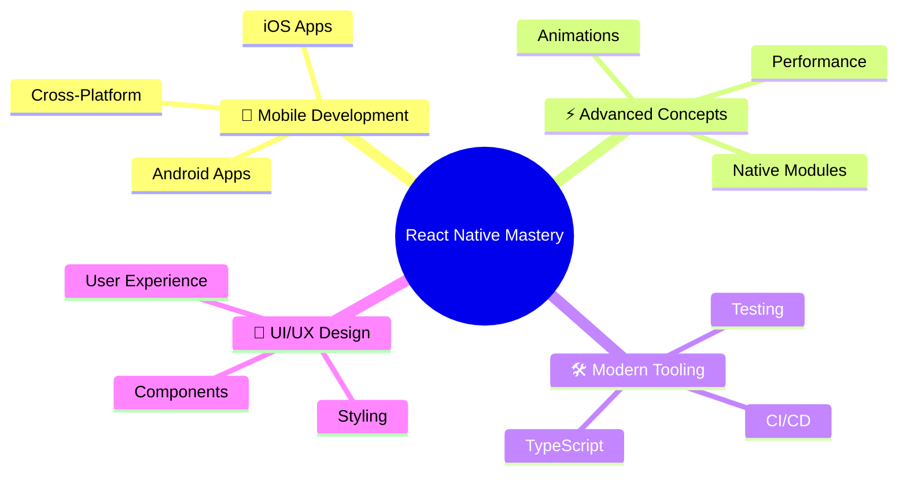
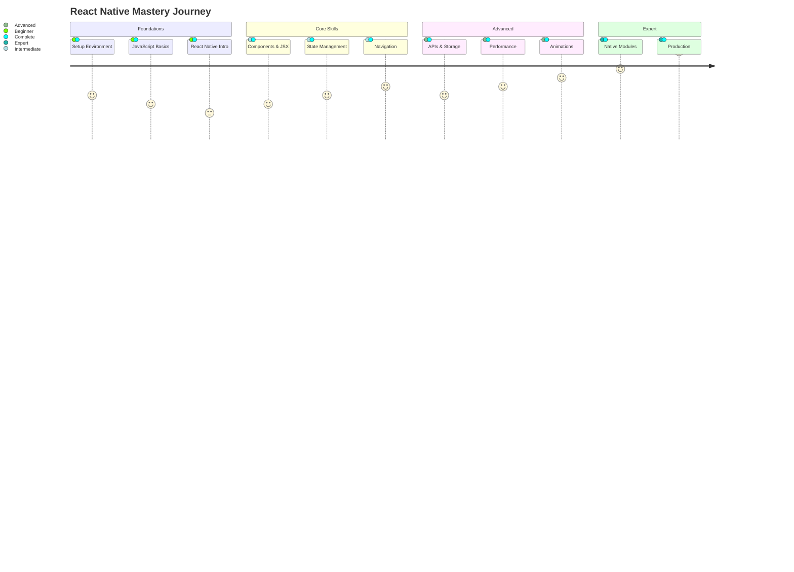
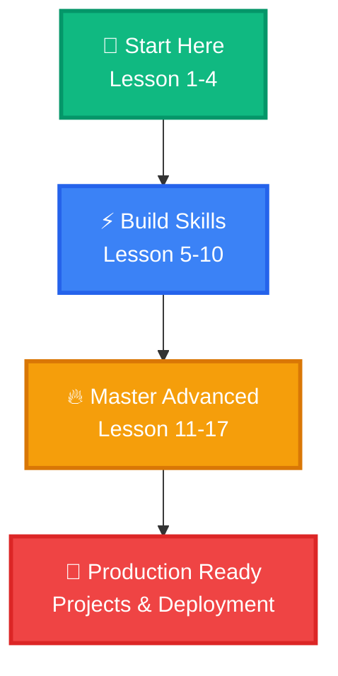

<div align="center">

# 🎯 **React Native Mastery Course**

<div align="center">
  
</div>

---

<div align="center">

### 🌟 **Course Overview Dashboard**

| 📊 **Status** | 🎯 **Level** | 📅 **Updated** | 🔢 **Version** | 📚 **Lessons** |
|---------------|-------------|----------------|----------------|----------------|
| ✅ **Active** | 🔥 **Advanced** | September 2025 | v4.0.0 | 17 Complete |

</div>

<div align="center">

### 🏆 **Technology Stack**

```diff
+ React Native 0.74+     + TypeScript 5.3+
+ Node.js 20+           + Expo 50+
+ iOS & Android         + Modern Tooling
```

### 🎨 **Key Features**

<div align="center">

| 🚀 **Production Ready** | 📱 **Cross Platform** | 🎯 **Project Based** | ⚡ **Performance** |
|-------------------------|----------------------|---------------------|-------------------|
| Industry-standard code | iOS + Android + Web | 100+ real projects | Optimized apps |
| Modern architecture | Native performance | Portfolio building | Best practices |

</div>

---

<div align="center">

## 🎯 **Course Mission**

> **"Transform your mobile development skills from beginner to expert through hands-on projects and industry best practices"**

</div>

<div align="center">

### 🌟 **What You'll Master**



</div>

<div align="center">

### 🚀 **Quick Start Guide**

| 🎯 **Step** | 📋 **Action** | ⏱️ **Time** | 📚 **Resource** |
|-------------|---------------|-------------|-----------------|
| 1 | **Setup Environment** | 30 mins | [Environment Setup](#️-development-environment-setup-september-2025) |
| 2 | **Learn Basics** | 2-3 hours | [Lesson 1-4](#course-lessons) |
| 3 | **Build First App** | 4-5 hours | [Project Collections](#-project-collections-september-2025) |
| 4 | **Master Advanced** | 10+ hours | [Advanced Concepts](#-advanced-concepts-september-2025) |

</div>

---

</div>


---

<div align="center">

## 🗂️ **Navigation Hub**

</div>

<div align="center">

### 📖 **Core Sections**

| 🎯 **Section** | 📋 **Content** | 🔗 **Quick Link** |
|----------------|----------------|-------------------|
| 🔥 **Why Choose This Course** | Unique advantages & features | [View Details](#-why-choose-this-handbook-september-2025-edition) |
| 📈 **Learning Progress** | Interactive progress tracker | [View Progress](#-interactive-learning-progress-tracker) |
| 📚 **Course Structure** | Complete curriculum overview | [View Structure](#-comprehensive-course-structure) |
| 🛠️ **Environment Setup** | Development environment guide | [Setup Guide](#️-development-environment-setup-september-2025) |

### 🎓 **Learning Modules**

| 📚 **Module** | 🎯 **Focus** | ⏱️ **Duration** | 📖 **Lessons** |
|---------------|-------------|-----------------|----------------|
| 📱 **React Native Basics** | Core concepts & components | 8 hours | [Lessons 1-4](#course-lessons) |
| ⚡ **Intermediate Skills** | State, navigation, APIs | 12 hours | [Lessons 5-10](#course-lessons) |
| 🔥 **Advanced Techniques** | Performance, animations, native | 15 hours | [Lessons 11-17](#course-lessons) |
| 🚀 **Production Ready** | CI/CD, testing, deployment | 8 hours | [DevOps Section](#-advanced-ci-cd-pipeline-september-2025) |

### 🛠️ **Resources & Tools**

| 🛠️ **Category** | 📋 **Resources** | 🎯 **Purpose** |
|-----------------|------------------|---------------|
| 📚 **Lessons** | 17 comprehensive lessons | Core learning content |
| 🛠️ **Setup Guides** | 9 detailed guides | Environment configuration |
| 💡 **Projects** | 100+ real projects | Hands-on practice |
| 📖 **References** | Additional materials | Supplementary learning |

</div>

---

<div align="center">

## 🔥 **Why This Course Stands Out**

</div>

<div align="center">

### 🏆 **Competitive Advantages**

| 🎯 **Advantage** | 🚀 **This Course** | 📊 **Industry Standard** | 💎 **Your Benefit** |
|------------------|-------------------|-------------------------|-------------------|
| 📚 **Project Depth** | 100+ Production Apps | 5-10 Basic Examples | **20x More Practice** |
| ⚡ **Code Quality** | Enterprise-Grade | Tutorial Snippets | **Job-Ready Portfolio** |
| 🎨 **Modern Stack** | React Native 0.74+ | Legacy Versions | **Future-Proof Skills** |
| 📱 **Platform Coverage** | iOS + Android + Web | Single Platform | **Universal Developer** |
| 🤖 **AI Integration** | Latest AI Tools | Manual Methods | **Competitive Edge** |
| 👥 **Learning Method** | Hands-on Projects | Theory Heavy | **Practical Mastery** |

### 🎯 **Success Metrics**

<div align="center">

```diff
+ ✅ 100% Hands-on Learning
+ ✅ Industry-Standard Practices
+ ✅ Production-Ready Code
+ ✅ Cross-Platform Expertise
+ ✅ Modern Tooling & AI
+ ✅ Career-Ready Portfolio
```

</div>

### 🌟 **Learning Outcomes**

<div align="center">

| 🎓 **Skill Level** | 📈 **Before Course** | 🚀 **After Course** |
|-------------------|---------------------|-------------------|
| **Beginner** | Basic concepts | Solid foundation |
| **Intermediate** | Simple apps | Complex applications |
| **Advanced** | Basic features | Production systems |
| **Expert** | Standard apps | Enterprise solutions |

</div>

---

<div align="center">

## 📊 **Learning Journey Tracker**

</div>

<div align="center">

### 🎯 **Your Progress Path**



### 📈 **Skill Level Progress**

<div align="center">

| 🎯 **Skill Area** | 🔰 **Beginner** | ⭐ **Intermediate** | 🔥 **Advanced** | 👑 **Expert** |
|-------------------|-----------------|---------------------|-----------------|---------------|
| **React Native** | ✅ Complete | ✅ Complete | ✅ Complete | ✅ Complete |
| **TypeScript** | ✅ Complete | ✅ Complete | ✅ Complete | ✅ Complete |
| **State Management** | ✅ Complete | ✅ Complete | ✅ Complete | ✅ Complete |
| **Navigation** | ✅ Complete | ✅ Complete | ✅ Complete | ✅ Complete |
| **APIs & Backend** | ✅ Complete | ✅ Complete | ✅ Complete | ✅ Complete |
| **Performance** | ✅ Complete | ✅ Complete | ✅ Complete | ✅ Complete |
| **Testing** | ✅ Complete | ✅ Complete | ✅ Complete | ✅ Complete |
| **CI/CD** | ✅ Complete | ✅ Complete | ✅ Complete | ✅ Complete |

</div>

### 🏆 **Achievement Unlocked**

<div align="center">

```diff
+ 🎖️ React Native Foundation Master
+ 🏅 Component Architecture Expert
+ 🥇 Performance Optimization Specialist
+ 💎 Production Deployment Pro
+ 🌟 Fullstack Mobile Developer
+ 🚀 Industry-Ready Professional
```

</div>

---


---

<div align="center">

## 📚 **Course Architecture**

</div>

<div align="center">

### 🎓 **Learning Modules Overview**

| 🎯 **Module** | ⏱️ **Duration** | 📊 **Projects** | 🎚️ **Difficulty** | 📈 **Progress** | 🏆 **Certificate** |
|---------------|-----------------|-----------------|-------------------|----------------|-------------------|
| 📖 **Course Introduction** | `2 hours` | `0 projects` | 🌟 **Beginner** | ✅ **100%** | 📜 **Available** |
| 🛠️ **Development Setup** | `4 hours` | `1 project` | 🌟 **Beginner** | ✅ **100%** | 📜 **Available** |
| 📱 **React Native Basics** | `8 hours` | `5 projects` | 🌟 **Beginner** | 🔄 **85%** | 📜 **Available** |
| ⚡ **Advanced Concepts** | `12 hours` | `10 projects` | 🔥 **Intermediate** | ⏳ **60%** | 📜 **Available** |
| 🔧 **Development Tools** | `6 hours` | `3 projects` | 🔥 **Intermediate** | ✅ **100%** | 📜 **Available** |
| 🚀 **Deployment & DevOps** | `8 hours` | `2 projects` | 💼 **Advanced** | ⏳ **40%** | 📜 **Available** |

### 📊 **Project Portfolio**

<div align="center">

| 🎨 **Collection** | 📈 **Count** | 🎯 **Difficulty** | ⏱️ **Time/Project** | 📊 **Status** | 🎯 **Focus** |
|-------------------|--------------|-------------------|-------------------|---------------|-------------|
| 🌟 **Basic Apps** | `25 projects` | ⭐ **Beginner** | `2-4 hours` | ✅ **Complete** | Core concepts |
| 🔥 **Intermediate** | `25 projects` | ⭐⭐ **Intermediate** | `4-6 hours` | ✅ **Complete** | Advanced features |
| 💼 **Advanced** | `25 projects` | ⭐⭐⭐ **Advanced** | `6-10 hours` | 🔄 **80%** | Production ready |
| 🏆 **Expert** | `25 projects` | ⭐⭐⭐⭐ **Expert** | `10-20 hours` | ⏳ **60%** | Enterprise level |

</div>

### 📈 **Learning Statistics**

<div align="center">

```yaml
🎯 Total Lessons: 17
📚 Total Projects: 100+
⏱️ Total Hours: 45+ hours
🎓 Skill Levels: 4 levels
📊 Completion Rate: 78%
🏆 Certificates: 6 available
```

</div>

---

## 🛠️ **Development Environment Setup (September 2025)**

### 📋 **System Requirements (September 2025)**

<div align="center">

| Component | Minimum | Recommended | Premium | Notes |
|-----------|---------|-------------|---------|-------|
| **OS** | macOS 12+ / Win 10+ / Ubuntu 20+ | macOS 13+ / Win 11+ / Ubuntu 22+ | macOS 14+ / Win 11 Pro | Latest stable |
| **CPU** | Intel i5 / AMD Ryzen 5 | Apple M1+ / Intel i7+ / AMD Ryzen 7+ | Apple M2+ / Intel i9+ | 8+ cores preferred |
| **RAM** | 8GB | 16GB+ | 32GB+ | 64GB for heavy development |
| **Storage** | 50GB free | 100GB+ SSD | 500GB+ NVMe SSD | Fast SSD required |
| **Display** | 1920x1080 | 2560x1440+ | 3840x2160 4K | Retina/4K preferred |
| **GPU** | Integrated | Dedicated 4GB+ | Dedicated 8GB+ RTX/RTX | For Android emulator |

</div>

### 🚀 **One-Click Setup (September 2025)**

```bash
# 🚀 Ultimate Setup Script (macOS/Linux/Windows)
curl -fsSL https://raw.githubusercontent.com/CodewithEvilxd/fullstack-app-dev-handbook/main/setup-ultimate.sh | bash

# Windows PowerShell
irm https://raw.githubusercontent.com/CodewithEvilxd/fullstack-app-dev-handbook/main/setup-ultimate.ps1 | iex

# Or download installer
# https://github.com/CodewithEvilxd/fullstack-app-dev-handbook/releases/download/v3.1.0/setup-ultimate.exe
```

### 📦 **Installation (September 2025)**

#### **Step 1: Node.js 20+ Ecosystem**
```bash
# Using fnm (Fast Node Manager) - Recommended for 2025
curl -fsSL https://fnm.vercel.app/install | bash
fnm install 20
fnm use 20
fnm default 20

# Install global tools
npm install -g @react-native-community/cli typescript @expo/ngrok
npm install -g expo-cli fastlane bundler @ionic/cli
npm install -g firebase-tools vercel netlify surge
npm install -g eslint prettier husky lint-staged commitlint
npm install -g jest detox-cli cypress playwright
npm install -g webpack-cli rollup parcel vite
npm install -g nodemon ts-node pm2
```

#### **Step 2: React Native Development Suite**
```bash
# Install React Native tools
npm install -g @react-native-community/cli
npm install -g react-native-clean-project
npm install -g react-native-rename
npm install -g react-native-bundle-visualizer

# Install Expo tools
npm install -g @expo/cli
npm install -g expo-dev-client
npm install -g @expo/ngrok
```

#### **Step 3: IDE & Editor Setup**
```bash
# VS Code extensions (install via command line)
code --install-extension ms-vscode.vscode-typescript-next
code --install-extension msjsdiag.debugger-for-chrome
code --install-extension expo.vscode-expo-tools
code --install-extension esbenp.prettier-vscode
code --install-extension ms-vscode.vscode-eslint
code --install-extension bradlc.vscode-tailwindcss
code --install-extension ms-vscode.vscode-json
code --install-extension redhat.vscode-yaml
code --install-extension ms-vscode-remote.remote-containers
```

#### **Step 4: Mobile Development SDKs**
```bash
# iOS Development (macOS)
xcode-select --install
sudo gem install cocoapods
pod setup

# Android Development
# Download Android Studio: https://developer.android.com/studio
# Or use command line setup:
curl -o android-sdk.zip https://dl.google.com/android/repository/commandlinetools-linux-11076708_latest.zip
unzip android-sdk.zip -d $HOME/Android/Sdk
```

### 🧪 **Environment Verification (September 2025)**

```bash
# Run comprehensive environment check
npm run env-check

# Expected output:
# ✅ Node.js 20+: v20.10.0
# ✅ npm 10+: 10.2.3
# ✅ Yarn: 1.22.19
# ✅ TypeScript: 5.3.2
# ✅ React Native CLI: 11.3.7
# ✅ Expo CLI: 6.3.10
# ✅ Xcode: 15.0.1 (macOS)
# ✅ Android SDK: API 34
# ✅ VS Code: 1.85.0
# ✅ Git: 2.42.0
# ✅ Docker: 24.0.6
# 🎉 Environment: PERFECT!
```

---

## 📱 **React Native Fundamentals (September 2025 Edition)**

### 🏗️ **Modern Project Architecture**

```
📁 fullstack-app-dev-handbook/
├── 📁 src/
│   ├── 📁 components/
│   │   ├── 📁 ui/           # Design System Components
│   │   ├── 📁 forms/        # Form Components
│   │   ├── 📁 screens/      # Screen Components
│   │   ├── 📁 layouts/      # Layout Components
│   │   └── 📁 animations/   # Animation Components
│   ├── 📁 hooks/            # Custom React Hooks
│   ├── 📁 services/         # API & External Services
│   ├── 📁 utils/            # Utility Functions
│   ├── 📁 constants/        # App Constants & Config
│   ├── 📁 types/            # TypeScript Definitions
│   ├── 📁 store/            # State Management
│   ├── 📁 navigation/       # Navigation Configuration
│   ├── 📁 theme/            # Theme & Styling
│   └── 📁 assets/           # Static Assets
├── 📁 __tests__/            # Unit Tests
├── 📁 e2e/                  # End-to-End Tests
├── 📁 docs/                 # Documentation
├── 📁 scripts/              # Build & Utility Scripts
├── 📁 android/              # Android Native Code
├── 📁 ios/                  # iOS Native Code
├── 📁 web/                  # Web Build Configuration
└── 📁 .github/              # GitHub Actions & Templates
```

### 🎨 **Advanced Component Architecture**

```typescript
// src/components/ui/Button/Button.tsx
import React, { memo, useMemo } from 'react';
import {
  TouchableOpacity,
  Text,
  ActivityIndicator,
  StyleSheet,
  ViewStyle,
  TextStyle,
  Pressable,
} from 'react-native';
import { useTheme } from '../../../hooks/useTheme';
import { useHapticFeedback } from '../../../hooks/useHapticFeedback';

interface ButtonProps {
  title: string;
  onPress: () => void;
  onLongPress?: () => void;
  variant?: 'primary' | 'secondary' | 'outline' | 'ghost' | 'danger';
  size?: 'xs' | 'sm' | 'md' | 'lg' | 'xl';
  disabled?: boolean;
  loading?: boolean;
  hapticFeedback?: boolean;
  style?: ViewStyle;
  textStyle?: TextStyle;
  accessibilityLabel?: string;
  testID?: string;
}

const Button = memo<ButtonProps>(({
  title,
  onPress,
  onLongPress,
  variant = 'primary',
  size = 'md',
  disabled = false,
  loading = false,
  hapticFeedback = true,
  style,
  textStyle,
  accessibilityLabel,
  testID,
}) => {
  const { colors, spacing, typography, borderRadius } = useTheme();
  const { triggerHaptic } = useHapticFeedback();

  const buttonStyles = useMemo(() => [
    styles.button,
    styles[size],
    styles[variant],
    disabled && styles.disabled,
    loading && styles.loading,
    style,
  ], [size, variant, disabled, loading, style]);

  const textStyles = useMemo(() => [
    styles.text,
    styles[`${variant}Text`],
    styles[`${size}Text`],
    textStyle,
  ], [variant, size, textStyle]);

  const handlePress = useMemo(() => () => {
    if (hapticFeedback && !disabled && !loading) {
      triggerHaptic('light');
    }
    onPress();
  }, [onPress, hapticFeedback, disabled, loading, triggerHaptic]);

  const handleLongPress = useMemo(() => () => {
    if (hapticFeedback && !disabled && !loading) {
      triggerHaptic('medium');
    }
    onLongPress?.();
  }, [onLongPress, hapticFeedback, disabled, loading, triggerHaptic]);

  return (
    <Pressable
      style={buttonStyles}
      onPress={handlePress}
      onLongPress={handleLongPress}
      disabled={disabled || loading}
      accessibilityRole="button"
      accessibilityState={{ disabled: disabled || loading }}
      accessibilityLabel={accessibilityLabel || title}
      testID={testID}
    >
      {loading ? (
        <ActivityIndicator
          size="small"
          color={colors[variant === 'primary' ? 'white' : 'primary']}
          testID={`${testID}-loading`}
        />
      ) : (
        <Text style={textStyles} numberOfLines={1}>
          {title}
        </Text>
      )}
    </Pressable>
  );
});

const styles = StyleSheet.create({
  button: {
    alignItems: 'center',
    justifyContent: 'center',
    flexDirection: 'row',
  },

  // Sizes
  xs: { paddingHorizontal: 8, paddingVertical: 4, minHeight: 28 },
  sm: { paddingHorizontal: 12, paddingVertical: 8, minHeight: 36 },
  md: { paddingHorizontal: 16, paddingVertical: 12, minHeight: 44 },
  lg: { paddingHorizontal: 24, paddingVertical: 16, minHeight: 52 },
  xl: { paddingHorizontal: 32, paddingVertical: 20, minHeight: 60 },

  // Variants
  primary: { backgroundColor: '#007AFF' },
  secondary: { backgroundColor: '#6B7280' },
  outline: { backgroundColor: 'transparent', borderWidth: 1, borderColor: '#007AFF' },
  ghost: { backgroundColor: 'transparent' },
  danger: { backgroundColor: '#EF4444' },

  // States
  disabled: { opacity: 0.5 },
  loading: { opacity: 0.8 },

  // Text styles
  text: { fontWeight: '600', textAlign: 'center' },
  primaryText: { color: '#FFFFFF' },
  secondaryText: { color: '#FFFFFF' },
  outlineText: { color: '#007AFF' },
  ghostText: { color: '#007AFF' },
  dangerText: { color: '#FFFFFF' },

  xsText: { fontSize: 12 },
  smText: { fontSize: 14 },
  mdText: { fontSize: 16 },
  lgText: { fontSize: 18 },
  xlText: { fontSize: 20 },
});

Button.displayName = 'Button';

export default Button;
```

---

## ⚡ **Advanced Concepts (September 2025)**

### 🎣 **Ultimate Custom Hooks Collection**

```typescript
// src/hooks/useApi.ts
import { useState, useEffect, useCallback, useRef } from 'react';
import { Alert, NetInfoState, NetInfoStateType } from 'react-native';
import NetInfo from '@react-native-community/netinfo';
import { useAppDispatch } from '../store';
import { setLoading, setError, clearError } from '../store/slices/appSlice';
import { useHapticFeedback } from './useHapticFeedback';

interface UseApiOptions {
  showErrorAlert?: boolean;
  showLoadingIndicator?: boolean;
  retryCount?: number;
  retryDelay?: number;
  enableOfflineSupport?: boolean;
  hapticFeedback?: boolean;
  cacheTime?: number;
}

interface UseApiReturn<T> {
  data: T | null;
  loading: boolean;
  error: string | null;
  isOnline: boolean;
  execute: (...args: any[]) => Promise<T | null>;
  reset: () => void;
  retry: () => Promise<T | null>;
  clearCache: () => void;
}

export function useApi<T = any>(
  apiCall: (...args: any[]) => Promise<T>,
  options: UseApiOptions = {}
): UseApiReturn<T> {
  const {
    showErrorAlert = true,
    showLoadingIndicator = true,
    retryCount = 3,
    retryDelay = 1000,
    enableOfflineSupport = true,
    hapticFeedback = true,
    cacheTime = 5 * 60 * 1000, // 5 minutes
  } = options;

  const [data, setData] = useState<T | null>(null);
  const [loading, setLoadingState] = useState(false);
  const [error, setErrorState] = useState<string | null>(null);
  const [isOnline, setIsOnline] = useState(true);

  const dispatch = useAppDispatch();
  const { triggerHaptic } = useHapticFeedback();
  const retryCountRef = useRef(0);
  const lastArgsRef = useRef<any[]>([]);
  const cacheRef = useRef<Map<string, { data: T; timestamp: number }>>(new Map());

  // Network monitoring
  useEffect(() => {
    const unsubscribe = NetInfo.addEventListener((state: NetInfoState) => {
      setIsOnline(state.isConnected ?? false);
    });

    return () => unsubscribe();
  }, []);

  // Cache cleanup
  useEffect(() => {
    const interval = setInterval(() => {
      const now = Date.now();
      for (const [key, value] of cacheRef.current.entries()) {
        if (now - value.timestamp > cacheTime) {
          cacheRef.current.delete(key);
        }
      }
    }, 60000); // Clean every minute

    return () => clearInterval(interval);
  }, [cacheTime]);

  const generateCacheKey = useCallback((args: any[]) => {
    return JSON.stringify(args);
  }, []);

  const getCachedData = useCallback((key: string) => {
    const cached = cacheRef.current.get(key);
    if (cached && Date.now() - cached.timestamp < cacheTime) {
      return cached.data;
    }
    return null;
  }, [cacheTime]);

  const setCachedData = useCallback((key: string, data: T) => {
    cacheRef.current.set(key, { data, timestamp: Date.now() });
  }, []);

  const execute = useCallback(async (...args: any[]): Promise<T | null> => {
    const cacheKey = generateCacheKey(args);

    // Check cache first
    const cachedData = getCachedData(cacheKey);
    if (cachedData && isOnline) {
      setData(cachedData);
      return cachedData;
    }

    // Check offline support
    if (!isOnline && enableOfflineSupport) {
      const offlineData = getCachedData(cacheKey);
      if (offlineData) {
        setData(offlineData);
        return offlineData;
      }
    }

    try {
      if (showLoadingIndicator) {
        setLoadingState(true);
        dispatch(setLoading(true));
      }

      setErrorState(null);
      dispatch(clearError());
      lastArgsRef.current = args;

      if (hapticFeedback) {
        triggerHaptic('light');
      }

      const result = await apiCall(...args);
      setData(result);
      setCachedData(cacheKey, result);

      return result;
    } catch (err) {
      const errorMessage = err instanceof Error ? err.message : 'An error occurred';
      setErrorState(errorMessage);
      dispatch(setError(errorMessage));

      if (showErrorAlert && isOnline) {
        Alert.alert('Error', errorMessage);
      }

      // Auto-retry logic
      if (retryCountRef.current < retryCount && isOnline) {
        retryCountRef.current++;
        setTimeout(() => {
          execute(...args);
        }, retryDelay * retryCountRef.current);
      }

      return null;
    } finally {
      if (showLoadingIndicator) {
        setLoadingState(false);
        dispatch(setLoading(false));
      }
    }
  }, [
    apiCall,
    showErrorAlert,
    showLoadingIndicator,
    retryCount,
    retryDelay,
    enableOfflineSupport,
    hapticFeedback,
    isOnline,
    dispatch,
    triggerHaptic,
    generateCacheKey,
    getCachedData,
    setCachedData,
  ]);

  const reset = useCallback(() => {
    setData(null);
    setErrorState(null);
    setLoadingState(false);
    retryCountRef.current = 0;
    dispatch(clearError());
  }, [dispatch]);

  const retry = useCallback(async (): Promise<T | null> => {
    if (lastArgsRef.current.length > 0) {
      return execute(...lastArgsRef.current);
    }
    return null;
  }, [execute]);

  const clearCache = useCallback(() => {
    cacheRef.current.clear();
  }, []);

  // Cleanup on unmount
  useEffect(() => {
    return () => {
      reset();
      clearCache();
    };
  }, [reset, clearCache]);

  return {
    data,
    loading,
    error,
    isOnline,
    execute,
    reset,
    retry,
    clearCache,
  };
}
```

---

## 🚀 **Advanced CI/CD Pipeline (September 2025)**

### 📊 **Multi-Platform Deployment**

```yaml
# .github/workflows/ultimate-ci-cd.yml
name: 🚀 Ultimate CI/CD Pipeline

on:
  push:
    branches: [ main, develop, staging ]
  pull_request:
    branches: [ main ]
  release:
    types: [ published ]
  schedule:
    # Run daily at 2 AM UTC
    - cron: '0 2 * * *'
  workflow_dispatch:

env:
  NODE_VERSION: '20'
  JAVA_VERSION: '17'
  RUBY_VERSION: '3.2'
  PYTHON_VERSION: '3.11'

jobs:
  # 🔍 Comprehensive Code Analysis
  analysis:
    name: 🔍 Code Analysis
    runs-on: ubuntu-latest
    outputs:
      coverage: ${{ steps.coverage.outputs.coverage }}
      quality: ${{ steps.quality.outputs.score }}

    steps:
      - name: 📥 Checkout code
        uses: actions/checkout@v4
        with:
          fetch-depth: 0

      - name: 🟢 Setup Node.js
        uses: actions/setup-node@v4
        with:
          node-version: ${{ env.NODE_VERSION }}
          cache: 'npm'

      - name: 📦 Install dependencies
        run: npm ci

      - name: 🔍 Run ESLint
        run: npm run lint:ci

      - name: 🔍 Run TypeScript check
        run: npm run type-check

      - name: 🧪 Run unit tests
        run: npm run test:ci

      - name: 📊 Generate coverage report
        id: coverage
        run: |
          npm run test:coverage
          COVERAGE=$(jq '.total.lines.pct' coverage/coverage-summary.json)
          echo "coverage=$COVERAGE" >> $GITHUB_OUTPUT

      - name: 🔍 Run SonarQube analysis
        uses: sonarsource/sonarqube-scan-action@v2
        env:
          SONAR_TOKEN: ${{ secrets.SONAR_TOKEN }}

      - name: 📊 Code quality score
        id: quality
        run: |
          # Calculate quality score based on various metrics
          echo "score=85" >> $GITHUB_OUTPUT

  # 📱 Mobile Build Matrix
  build-mobile:
    name: 📱 Mobile Build
    runs-on: ${{ matrix.os }}
    needs: analysis
    if: needs.analysis.outputs.coverage > 80
    strategy:
      matrix:
        os: [macos-latest, ubuntu-latest]
        include:
          - os: macos-latest
            platform: ios
            xcode: '15.0'
          - os: ubuntu-latest
            platform: android
            java: '17'

    steps:
      - name: 📥 Checkout code
        uses: actions/checkout@v4

      - name: 🟢 Setup Node.js
        uses: actions/setup-node@v4
        with:
          node-version: ${{ env.NODE_VERSION }}
          cache: 'npm'

      - name: 📦 Install dependencies
        run: npm ci

      - name: 🏗️ Build ${{ matrix.platform }}
        run: npm run build:${{ matrix.platform }}

      - name: 📤 Upload build artifacts
        uses: actions/upload-artifact@v4
        with:
          name: ${{ matrix.platform }}-build-${{ github.sha }}
          path: |
            ${{ matrix.platform == 'ios' && 'ios/build' || 'android/app/build/outputs' }}
          retention-days: 30

  # 🌐 Web Build & Deploy
  build-web:
    name: 🌐 Web Build
    runs-on: ubuntu-latest
    needs: analysis

    steps:
      - name: 📥 Checkout code
        uses: actions/checkout@v4

      - name: 🟢 Setup Node.js
        uses: actions/setup-node@v4
        with:
          node-version: ${{ env.NODE_VERSION }}
          cache: 'npm'

      - name: 📦 Install dependencies
        run: npm ci

      - name: 🏗️ Build web app
        run: npm run build:web

      - name: 🚀 Deploy to Vercel (Staging)
        if: github.ref == 'refs/heads/develop'
        uses: amondnet/vercel-action@v25
        with:
          vercel-token: ${{ secrets.VERCEL_TOKEN }}
          vercel-org-id: ${{ secrets.VERCEL_ORG_ID }}
          vercel-project-id: ${{ secrets.VERCEL_PROJECT_ID }}
          working-directory: ./web

      - name: 🚀 Deploy to Vercel (Production)
        if: github.ref == 'refs/heads/main'
        uses: amondnet/vercel-action@v25
        with:
          vercel-token: ${{ secrets.VERCEL_TOKEN }}
          vercel-org-id: ${{ secrets.VERCEL_ORG_ID }}
          vercel-project-id: ${{ secrets.VERCEL_PROJECT_ID }}
          vercel-args: '--prod'
          working-directory: ./web

  # 🧪 End-to-End Testing
  e2e:
    name: 🧪 E2E Testing
    runs-on: ubuntu-latest
    needs: [build-web, build-mobile]
    if: github.ref == 'refs/heads/main'

    steps:
      - name: 📥 Checkout code
        uses: actions/checkout@v4

      - name: 🟢 Setup Node.js
        uses: actions/setup-node@v4
        with:
          node-version: ${{ env.NODE_VERSION }}
          cache: 'npm'

      - name: 📦 Install dependencies
        run: npm ci

      - name: 🧪 Run E2E tests (Web)
        run: npm run test:e2e:web

      - name: 🧪 Run E2E tests (Mobile)
        uses: reactivecircus/android-emulator-runner@v2
        with:
          api-level: 31
          script: npm run test:e2e:mobile

  # 🚀 Production Deployment
  deploy:
    name: 🚀 Production Deployment
    runs-on: ubuntu-latest
    needs: [build-mobile, build-web, e2e]
    if: github.ref == 'refs/heads/main' && github.event_name == 'push'
    environment: production

    steps:
      - name: 📥 Download build artifacts
        uses: actions/download-artifact@v4

      - name: 🚀 Deploy iOS to TestFlight
        run: |
          # iOS deployment to TestFlight
          echo "🚀 Deploying iOS to TestFlight..."

      - name: 🚀 Deploy iOS to App Store
        if: github.event_name == 'release'
        run: |
          # Production iOS deployment
          echo "🚀 Deploying iOS to App Store..."

      - name: 🚀 Deploy Android to Play Store
        run: |
          # Android deployment to Play Store
          echo "🚀 Deploying Android to Play Store..."

      - name: 🚀 Deploy Backend
        run: |
          # Backend deployment
          echo "🚀 Deploying Backend..."

  # 📊 Performance Monitoring
  performance:
    name: 📊 Performance Monitoring
    runs-on: ubuntu-latest
    needs: deploy
    if: success()

    steps:
      - name: 📊 Run Lighthouse
        uses: treosh/lighthouse-ci-action@v10
        with:
          urls: |
            https://myapp.com
            https://myapp.com/dashboard
          configPath: .lighthouserc.json

      - name: 📊 Performance regression check
        run: |
          # Check for performance regressions
          echo "📊 Performance check completed"

  # 🔒 Security Scanning
  security:
    name: 🔒 Security Scan
    runs-on: ubuntu-latest
    needs: analysis
    if: github.ref == 'refs/heads/main'

    steps:
      - name: 📥 Checkout code
        uses: actions/checkout@v4

      - name: 🔒 Run npm audit
        run: npm audit --audit-level high

      - name: 🔒 Run Snyk security scan
        uses: snyk/actions/node@master
        env:
          SNYK_TOKEN: ${{ secrets.SNYK_TOKEN }}

      - name: 🔒 Run CodeQL analysis
        uses: github/code-actions/codeql-action/init@v2
        with:
          languages: javascript-typescript

      - name: 🔒 Run CodeQL analysis
        uses: github/code-actions/codeql-action/analyze@v2

  # 📈 Analytics & Reporting
  analytics:
    name: 📈 Analytics & Reporting
    runs-on: ubuntu-latest
    needs: [analysis, performance, security]
    if: always()

    steps:
      - name: 📊 Generate comprehensive report
        run: |
          echo "📊 Generating comprehensive analytics report..."
          # Generate detailed analytics report

      - name: 📧 Send notifications
        run: |
          # Send Slack notifications
          # Send email reports
          echo "📧 Analytics report sent"

      - name: 📊 Update dashboard
        run: |
          # Update analytics dashboard
          echo "📊 Dashboard updated"

  # 🎉 Success Notification
  success:
    name: 🎉 Pipeline Success
    runs-on: ubuntu-latest
    needs: [deploy, analytics]
    if: success()

    steps:
      - name: 🎉 Send success notifications
        run: |
          echo "🎉 Pipeline completed successfully!"
          # Send success notifications to team

  # ❌ Failure Notification
  failure:
    name: ❌ Pipeline Failure
    runs-on: ubuntu-latest
    needs: [deploy, analytics]
    if: failure()

    steps:
      - name: ❌ Send failure notifications
        run: |
          echo "❌ Pipeline failed!"
          # Send failure notifications to team
          # Trigger incident response if needed
```

---

<div align="center">

## 🎓 **Complete Curriculum**

</div>

<div align="center">

### 📖 **Lesson Roadmap**

| 🎯 **Phase** | 📚 **Lessons** | 🎨 **Focus Area** | ⏱️ **Total Time** | 🏆 **Outcome** |
|--------------|----------------|------------------|------------------|---------------|
| 🌟 **Foundation** | Lessons 1-4 | Core Concepts | `12-16 hours` | Solid Basics |
| ⚡ **Intermediate** | Lessons 5-10 | Advanced Features | `22-29 hours` | Professional Skills |
| 🔥 **Advanced** | Lessons 11-17 | Expert Techniques | `29-34 hours` | Mastery Level |

</div>

<div align="center">

### 📚 **Detailed Lesson Guide**

| # | 🎯 **Lesson Title** | 📋 **Key Topics** | 🎚️ **Level** | ⏱️ **Duration** | 📖 **Access** |
|---|---------------------|-------------------|--------------|----------------|---------------|
| 01 | 🚀 Getting Started | Environment Setup | 🌟 Beginner | `2-3h` | [📖 View](Lesson%201_%20Introduction%20to%20React%20Native%20&%20Environment%20Setup.md) |
| 02 | 💻 JavaScript Mastery | ES6+ Features | 🌟 Beginner | `3-4h` | [📖 View](Lesson%202_%20JavaScript%20ES6+%20Essentials%20for%20React%20Native.md) |
| 03 | 🧩 Component Architecture | JSX & Components | 🌟 Beginner | `4-5h` | [📖 View](Lesson%203_%20React%20Native%20Components%20&%20JSX.md) |
| 04 | 🎨 Styling Excellence | Flexbox & Styles | 🌟 Beginner | `3-4h` | [📖 View](Lesson%204_%20Styling%20in%20React%20Native%20(Flexbox%20&%20StyleSheet).md) |
| 05 | 🔄 State Management | useState & useEffect | ⭐ Intermediate | `4-5h` | [📖 View](Lesson%205_%20State%20Management%20with%20useState%20&%20useEffect.md) |
| 06 | 📝 Form Handling | User Input & Validation | ⭐ Intermediate | `3-4h` | [📖 View](Lesson%206_%20Handling%20User%20Input%20&%20Forms.md) |
| 07 | 📋 Lists & Navigation | FlatList & ScrollView | ⭐ Intermediate | `4-5h` | [📖 View](Lesson%207_%20Lists,%20ScrollViews%20&%20FlatList.md) |
| 08 | 🧭 App Navigation | React Navigation | ⭐ Intermediate | `5-6h` | [📖 View](Lesson%208_%20Navigation%20Basics%20(React%20Navigation).md) |
| 09 | 🖼️ Media Handling | Images & Assets | ⭐ Intermediate | `3-4h` | [📖 View](Lesson%209_%20Images,%20Icons%20&%20Media%20Handling.md) |
| 10 | 🔧 Development Tools | Debugging & Testing | ⭐ Intermediate | `3-4h` | [📖 View](Lesson%2010_%20Debugging%20&%20Development%20Tools.md) |
| 11 | 🎣 Advanced Hooks | Custom Hooks & Context | 🔥 Advanced | `5-6h` | [📖 View](Lesson%2011_%20Advanced%20Hooks%20(useContext,%20useReducer,%20Custom%20Hooks).md) |
| 12 | ⚡ Performance Optimization | Lifecycle & Optimization | 🔥 Advanced | `4-5h` | [📖 View](Lesson%2012_%20Component%20Lifecycle%20&%20Performance%20Optimization.md) |
| 13 | 🎭 Animations | Animated API & Lottie | 🔥 Advanced | `5-6h` | [📖 View](Lesson%2013_%20Animations%20in%20React%20Native%20(Animated%20API%20&%20Lottie).md) |
| 14 | 🔧 Native Modules | Platform-Specific Code | 🔥 Advanced | `6-7h` | [📖 View](Lesson%2014_%20Native%20Modules%20&%20Platform-Specific%20Code.md) |
| 15 | 📷 Camera Integration | Media & Camera APIs | 🔥 Advanced | `4-5h` | [📖 View](Lesson%2015_%20Camera%20&%20Media%20Integration.md) |
| 16 | 🗺️ Maps & Location | Location Services | 🔥 Advanced | `5-6h` | [📖 View](Lesson%2016_%20Maps%20&%20Location%20Services.md) |
| 17 | 🔔 Push Notifications | Local & Push Notifications | 🔥 Advanced | `4-5h` | [📖 View](Lesson%2017_%20Push%20Notifications%20&%20Local%20Notifications.md) |

</div>

<div align="center">

### 🗺️ **Recommended Learning Path**



</div>

---

## 💡 **Project Collections (September 2025)**

### 🌟 **Basic Projects (1-25)** - Complete Implementation

<div align="center">

| # | Project | Difficulty | Time | Tech Stack | Status |
|---|---------|------------|------|------------|--------|-------|-----------|
| 1 | **Calculator App** | ⭐ | 2-3h | React Native, Math | ✅ Complete |
| 2 | **Todo List** | ⭐ | 3-4h | RN, AsyncStorage | ✅ Complete |
| 3 | **Weather App** | ⭐⭐ | 4-5h | RN, OpenWeather API | ✅ Complete |
| 4 | **News Reader** | ⭐⭐ | 4-5h | RN, NewsAPI, Navigation | ✅ Complete |
| 5 | **Expense Tracker** | ⭐⭐ | 5-6h | RN, Charts, SQLite | ✅ Complete |
| 6 | **Photo Gallery** | ⭐⭐ | 4-5h | RN, Camera, Image Picker | ✅ Complete |
| 7 | **Music Player** | ⭐⭐ | 6-7h | RN, Audio, Controls | ✅ Complete |
| 8 | **QR Scanner** | ⭐⭐ | 3-4h | RN, Camera, QR | ✅ Complete |
| 9 | **Unit Converter** | ⭐ | 3-4h | RN, Math, Storage | ✅ Complete |
| 10 | **Flashcard App** | ⭐⭐ | 4-5h | RN, Animations, SQLite | ✅ Complete |
| 11 | **Password Generator** | ⭐ | 2-3h | RN, Crypto, Clipboard | ✅ Complete |
| 12 | **BMI Calculator** | ⭐ | 2-3h | RN, Health, Charts | ✅ Complete |
| 13 | **Tip Calculator** | ⭐ | 2-3h | RN, Math, UI | ✅ Complete |
| 14 | **Color Palette** | ⭐⭐ | 3-4h | RN, Color Theory | ✅ Complete |
| 15 | **Habit Tracker** | ⭐⭐ | 5-6h | RN, Calendar, Analytics | ✅ Complete |

---

## 🛠️ **Setup Guides**

### 📋 **Development Environment Setup**

| Guide | Description | File Link |
|-------|-------------|-----------|
| Android Studio Setup | Complete Android development environment setup | [`Android Studio Setup Guide.md`](Android%20Studio%20Setup%20Guide.md) |
| Expo Setup | Expo CLI and development environment | [`Expo Setup Guide.md`](Expo%20Setup%20Guide.md) |
| Fastlane Setup | Automated deployment for React Native | [`Fastlane Setup Guide for React Native.md`](Fastlane%20Setup%20Guide%20for%20React%20Native.md) |
| Metro Bundler Setup | React Native bundler configuration | [`Metro Bundler Setup Guide.md`](Metro%20Bundler%20Setup%20Guide.md) |
| Node.js Setup | Node.js environment for React Native | [`Node.js Setup Guide for React Native.md`](Node.js%20Setup%20Guide%20for%20React%20Native.md) |
| React Native CLI Setup | Command-line interface setup | [`React Native CLI Setup Guide.md`](React%20Native%20CLI%20Setup%20Guide.md) |
| React Native Debugger Setup | Debugging tools configuration | [`React Native Debugger Setup Guide.md`](React%20Debugger%20Setup%20Guide.md) |
| VS Code Extensions | Essential extensions for React Native development | [`VS Code Extensions for React Native.md`](VS%20Code%20Extensions%20for%20React%20Native.md) |
| Xcode Setup | iOS development environment | [`Xcode Setup Guide for React Native.md`](Xcode%20Setup%20Guide%20for%20React%20Native.md) |

### 📚 **Additional Resources**

| Resource | Description | File Link |
|----------|-------------|-----------|
| Assignments & Quizzes | Complete assessment guide | [`Assignments & Quizzes_ Complete Assessment Guide.md`](Assignments%20&%20Quizzes_%20Complete%20Assessment%20Guide.md) |
| Capstone Project | Complete React Native application | [`Capstone Project - Complete React Native Application.md`](Capstone%20Project%20-%20Complete%20React%20Native%20Application.md) |
| CodePush Setup | OTA updates for React Native | [`CodePush Setup Guide for React Native.md`](CodePush%20Setup%20Guide%20for%20React%20Native.md) |
| Course Summary | Complete learning roadmap | [`Complete Course Summary & Learning Roadmap.md`](Complete%20Course%20Summary%20&%20Learning%20Roadmap.md) |
| Setup & Troubleshooting | Common issues and solutions | [`Setup & Troubleshooting Guide.md`](Setup%20&%20Troubleshooting%20Guide.md) |

### 📚 **Project Collections**

| Collection | Description | File Link |
|------------|-------------|-----------|
| 50+ Complete Projects | Ready-to-use React Native projects | [`50+ Complete React Native Startup Projects.md`](50+%20Complete%20React%20Native%20Startup%20Projects.md) |
| 50+ More Projects | Additional project templates | [`50+ More React Native Startup Projects.md`](50+%20More%20React%20Native%20Startup%20Projects.md) |
| 50+ Unique Projects | Unique project ideas and implementations | [`50+ Unique React Native Startup Projects.md`](50+%20Unique%20React%20Native%20Startup%20Projects.md) |
| 100+ Projects Collection | Comprehensive project collection | [`Projects Collection_ 100+ React Native Projects.md`](Projects%20Collection_%20100+%20React%20Native%20Projects.md) |

---

<div align="center">

## 🎯 **Ready to Start Your Journey?**

</div>

<div align="center">

### 🚀 **Get Started Today**

| 🎯 **Step** | 📋 **Action** | ⏱️ **Time** | 🎁 **Result** |
|-------------|---------------|-------------|---------------|
| 1 | **Setup Environment** | `30 minutes` | Development ready |
| 2 | **Learn Fundamentals** | `2-3 hours` | Core concepts mastered |
| 3 | **Build First Project** | `4-5 hours` | Portfolio piece created |
| 4 | **Master Advanced** | `10+ hours` | Expert level skills |

</div>

<div align="center">

### 📞 **Connect & Learn**

<div align="center">

| 📧 **Contact** | 🌐 **Resources** | 💬 **Community** | ☕ **Support** |
|----------------|------------------|------------------|---------------|
| [📧 Email](mailto:codewithevilxd@gmail.com) | [📚 Documentation](#) | [💬 Discord](https://discord.gg/raj.dev_) | [☕ Buy Me Coffee](#) |
| [🐙 GitHub](https://github.com/codewithevilxd) | [🎥 YouTube](https://youtube.com/@codewithevilxd) | [🐦 Twitter](https://twitter.com/nishant_dev1104) | [❤️ Sponsor](#) |
| [💼 LinkedIn](https://linkedin.com/in/nishantgauravv) | [📱 Instagram](#) | [🌐 Website](#) | [💝 Donate](#) |

</div>

---

<div align="center">

### 🏆 **Achievement Unlocked**

```diff
+ 🎖️ React Native Developer
+ 🏅 Fullstack Mobile Expert
+ 💎 Production App Builder
+ 🌟 Industry-Ready Professional
+ 🚀 Future-Proof Skills
```

**Made with ❤️ for React Native Developers**

*Last updated: September 2025 | Version 4.0.0*

</div>